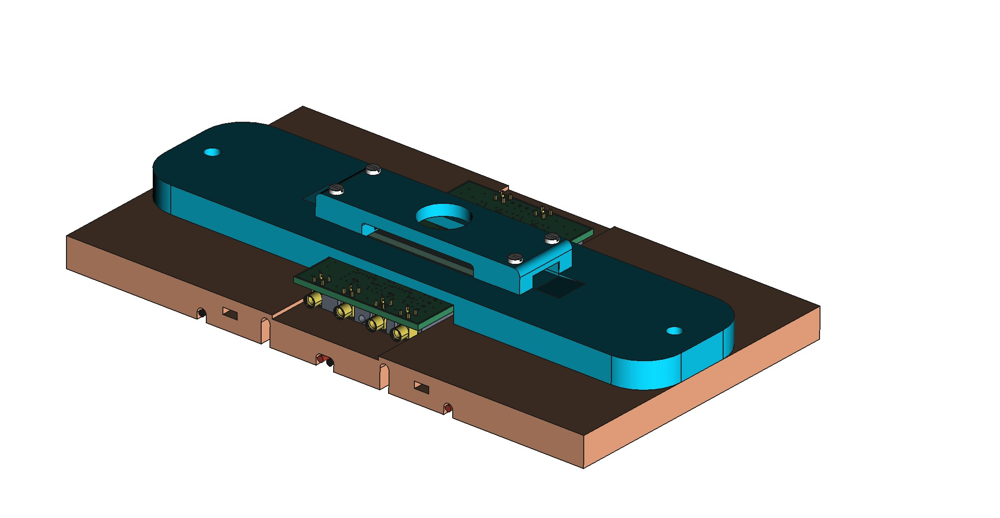

# TCTMechanics
Models and Drawings of low temperature TCT implementation with UZH Boards.

   

The model is composed of three parts: 
- A base plate that serves as a support frame for the 4 peltier elements used in the ssystem
- An anodized aluminum interposer used to ensure thermal contact between the readout boards and the peltier stack
- A clamp that holdes the readout board in place
- A clamp that fixes and alignes the doughtert baord that carries the sensor under test

  The system is designed tow ork with a two stage pelter cooling ontop the standard Particulards water cooling aluminum block provided witht he bid TCT setup.
  
